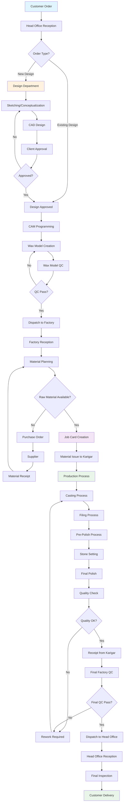

# Jewelry ERP System: Complete Logic Flow & Architecture

This document provides a comprehensive analysis of the jewelry manufacturing workflow, business logic, and system architecture requirements based on the Esatto Factory system analysis and Google Sheets order structure.

## 🔄 **Complete Business Flow Diagram**



## 📊 **Detailed Process Analysis**

### **1. Order Reception & Design Phase**
```
Fields Required:
├── Order Information
│   ├── Order Number (Auto: ORD-YYYYMMDD-XXX)
│   ├── Bag Number (Optional reference)
│   ├── Client Details (Name, Category, Contact)
│   ├── Order Date & Delivery Date
│   └── Urgency Level (Normal/Urgent/Rush)
│
├── Product Specifications
│   ├── Design Number (New/Existing)
│   ├── Product Description
│   ├── Quantity
│   ├── Metal Type (Gold/Silver/Platinum)
│   ├── Metal Purity (18K, 22K, 925 Silver)
│   └── Estimated Weight
│
└── Stone Requirements
    ├── Stone Type (Diamond/Ruby/Emerald/etc.)
    ├── Stone Size/Carat
    ├── Stone Quality/Grade
    ├── Number of Stones
    └── Stone Setting Type

Status Flow:
RECEIVED → DESIGN_PENDING → CAD_PENDING → CAD_COMPLETED → 
CAM_PENDING → CAM_COMPLETED → WAX_PENDING → WAX_COMPLETED
```

### **2. Factory Production Phase**
```
Job Card Creation:
├── Linked to Order
├── Assigned Karigar & Process
├── Material Requirements
│   ├── Metal Quantity (with wastage allowance)
│   ├── Stone Requirements
│   ├── Consumables (polish, chemicals)
│   └── Tools/Equipment needed
│
├── Work Instructions
│   ├── Process Steps
│   ├── Quality Requirements
│   ├── Special Instructions
│   └── Reference Images
│
└── Tracking Fields
    ├── Estimated Hours
    ├── Priority Level
    ├── Start/End Times
    └── Milestone Checkpoints

Material Flow:
├── Issue Process
│   ├── Gross Weight Issued
│   ├── Stone Weight Issued
│   ├── Net Metal Weight (Gross - Stone)
│   ├── Issue Date & Time
│   └── Authorized By
│
└── Receipt Process
    ├── Gross Weight Received
    ├── Stone Weight Received
    ├── Wastage Weight
    ├── Scrap Recovery
    ├── Net Metal Balance
    └── Quality Status

Status Flow:
MATERIAL_ISSUED → IN_PRODUCTION → CASTING_COMPLETED → 
FILING_COMPLETED → POLISHING_COMPLETED → STONE_SETTING_COMPLETED → 
QUALITY_APPROVED → PRODUCTION_COMPLETED
```

### **3. Quality Control System**
```
Quality Checkpoints:
├── Material Quality Check
│   ├── Metal Purity Verification
│   ├── Stone Authenticity Check
│   └── Weight Verification
│
├── Process Quality Checks
│   ├── Casting Quality (porosity, finish)
│   ├── Filing Quality (shape, dimensions)
│   ├── Polish Quality (surface finish)
│   ├── Stone Setting (security, alignment)
│   └── Overall Craftsmanship
│
└── Final Quality Audit
    ├── Dimensional Check
    ├── Weight Verification
    ├── Visual Inspection
    ├── Functional Test
    └── Customer Requirement Match

Quality Results:
├── PASS → Continue to next stage
├── MINOR_REWORK → Fix and recheck
├── MAJOR_REWORK → Return to specific process
└── REJECT → Complete restart
```

### **4. Dispatch & Gatepass System**
```
Gatepass Creation:
├── Gatepass Number (GP-OUT/IN-YYYYMMDD-XXX)
├── Direction (HO_TO_FACTORY / FACTORY_TO_HO)
├── Item Details
│   ├── Order Numbers included
│   ├── Item descriptions
│   ├── Quantities & Weights
│   ├── Estimated Values
│   └── Item Condition (NEW/WIP/COMPLETED)
│
├── Transport Details
│   ├── Transport Mode (Courier/Hand/Pickup)
│   ├── Courier Details
│   ├── Vehicle Information
│   ├── Driver Details
│   └── Security Seal Number
│
└── Authorization
    ├── Prepared By
    ├── Authorized By
    ├── Security Code
    └── Insurance Details

Status Tracking:
PREPARED → DISPATCHED → IN_TRANSIT → RECEIVED → VERIFIED
```

## 🔄 **Critical Business Logic Requirements**

### **1. Weight Management Logic**
```javascript
// Weight calculations must be precise for jewelry
calculateNetWeight = (grossWeight, stoneWeight) => {
    return grossWeight - stoneWeight;
}

calculateWastage = (issuedWeight, receivedWeight, scrapWeight) => {
    return issuedWeight - receivedWeight - scrapWeight;
}

calculateWastagePercentage = (wastageWeight, issuedWeight) => {
    return (wastageWeight / issuedWeight) * 100;
}

// Business Rules:
// - Wastage > 5% requires supervisor approval
// - Negative wastage indicates error or theft
// - Scrap must be recovered and accounted for
```

### **2. Status Transition Logic**
```javascript
// Valid status transitions with business rules
const statusTransitions = {
    'RECEIVED': ['DESIGN_PENDING', 'DESIGN_APPROVED', 'ON_HOLD', 'CANCELLED'],
    'DESIGN_PENDING': ['DESIGN_APPROVED', 'ON_HOLD', 'CANCELLED'],
    'DESIGN_APPROVED': ['CAD_PENDING'],
    'CAD_PENDING': ['CAD_COMPLETED', 'DESIGN_PENDING'], // Can go back for revisions
    'WAX_COMPLETED': ['DISPATCHED_TO_FACTORY'],
    'MATERIAL_ISSUED': ['IN_PRODUCTION', 'ON_HOLD'],
    'IN_PRODUCTION': ['CASTING_PENDING', 'FILING_PENDING', 'POLISHING_PENDING', 'STONE_SETTING_PENDING'],
    'QUALITY_CHECK_PENDING': ['QUALITY_APPROVED', 'REWORK_REQUIRED'],
    'PRODUCTION_COMPLETED': ['DISPATCHED_TO_HEAD_OFFICE'],
    'DELIVERED': [] // Final state
};

// Business Rules:
// - Cannot skip mandatory quality checks
// - Rework resets to appropriate previous stage
// - Some transitions require supervisor approval
```

### **3. Cost Calculation Logic**
```javascript
// Comprehensive costing system
calculateOrderCost = (order) => {
    const materialCost = calculateMaterialCost(order.metalWeight, order.metalType, order.stones);
    const laborCost = calculateLaborCost(order.processHours, order.complexity);
    const overheadCost = calculateOverheadCost(materialCost + laborCost);
    const wastageAllowance = calculateWastageAllowance(materialCost);
    
    return {
        materialCost,
        laborCost,
        overheadCost,
        wastageAllowance,
        totalCost: materialCost + laborCost + overheadCost + wastageAllowance
    };
};

// Business Rules:
// - Material cost based on current market rates
// - Labor cost varies by karigar skill level
// - Overhead includes facility, admin, and tool costs
// - Wastage allowance varies by process complexity
```

## 📋 **Enhanced Data Structure Requirements**

### **1. Order Master Enhanced**
```typescript
interface OrderMaster {
    // Basic Information
    orderNo: string;
    bagNo?: string;
    clientId: string;
    clientCategory: ClientCategory;
    
    // Product Details
    productType: 'RING' | 'NECKLACE' | 'EARRINGS' | 'BRACELET' | 'PENDANT' | 'OTHER';
    designNo?: string;
    description: string;
    quantity: number;
    
    // Metal Specifications
    metalType: 'GOLD' | 'SILVER' | 'PLATINUM' | 'WHITE_GOLD';
    metalPurity: string; // '18K', '22K', '925', 'PT950'
    estimatedMetalWeight: number;
    
    // Stone Specifications
    stones: StoneDetail[];
    
    // Pricing
    quotedPrice?: number;
    actualCost?: number;
    profitMargin?: number;
    
    // Timeline
    orderDate: Date;
    quotedDeliveryDate: Date;
    promisedDeliveryDate?: Date;
    actualDeliveryDate?: Date;
    
    // Status & Location
    currentStatus: OrderStatus;
    currentLocation: Location;
    currentKarigarId?: string;
    currentProcessId?: string;
    
    // Progress & Analytics
    progressPercentage: number;
    totalHoursEstimated?: number;
    totalHoursActual?: number;
    qualityScore?: number;
    
    // Special Instructions
    specialInstructions?: string;
    packagingInstructions?: string;
    deliveryInstructions?: string;
    
    // Documents & Media
    designImages: string[];
    referenceImages: string[];
    qualityCertificates: string[];
    
    // Audit Trail
    createdBy: string;
    createdAt: Date;
    updatedAt: Date;
}

interface StoneDetail {
    stoneType: string;
    stoneSize: string;
    stoneQuality: string;
    quantity: number;
    caratWeight?: number;
    shape: string;
    settingType: string;
    supplierCertificate?: string;
}
```

### **2. Enhanced Job Card System**
```typescript
interface JobCard {
    jobCardNo: string;
    orderId: string;
    
    // Assignment
    assignedKarigarId: string;
    assignedProcessId: string;
    supervisorId?: string;
    priority: Priority;
    
    // Work Details
    workInstructions: string;
    qualityRequirements: QualityRequirement[];
    specialTools?: string[];
    
    // Material Tracking
    issuedMaterials: IssuedMaterial[];
    consumedMaterials: ConsumedMaterial[];
    returnedMaterials: ReturnedMaterial[];
    wastageRecords: WastageRecord[];
    scrapRecords: ScrapRecord[];
    
    // Time & Progress
    estimatedHours: number;
    actualHours: number;
    startDateTime?: Date;
    endDateTime?: Date;
    milestones: ProcessMilestone[];
    
    // Quality
    qualityChecks: QualityCheck[];
    reworkHistory: ReworkRecord[];
    
    // Measurements
    finalMeasurements: Record<string, number>;
    finalWeight: number;
    finalPhotos: string[];
    
    // Status
    status: JobCardStatus;
    completionPercentage: number;
    
    // Comments
    karigarComments: string;
    supervisorComments: string;
    qualityComments: string;
}
```

## 🚨 **Critical Business Rules to Implement**

### **1. Material Security Rules**
- All material movements must be tracked with precise weights
- Negative balances must trigger immediate alerts
- Scrap recovery must be mandatory for precious metals
- Material transfers require dual authorization
- Daily material reconciliation reports required

### **2. Quality Assurance Rules**
- Mandatory quality checkpoints cannot be skipped
- Failed quality checks must specify rework requirements
- Quality scores affect karigar performance ratings
- Customer complaints must be traced back to specific process steps

### **3. Timeline Management Rules**
- Delayed orders must escalate automatically
- Rush orders get priority scheduling
- Delivery promises cannot be changed without approval
- Timeline delays must be justified and documented

### **4. Cost Control Rules**
- Material wastage exceeding thresholds requires investigation
- Labor hours exceeding estimates need approval
- Cost overruns must be pre-approved by management
- Profitability analysis required for each order

## 💡 **Implementation Phases**

### **Phase 1: Foundation (Completed ✅)**
- Order lifecycle with basic status tracking
- Order creation, editing, and listing
- Status history and timeline tracking
- Progress percentage calculation

### **Phase 2: Dispatch System (Next)**
- Gatepass functionality with material security
- Head Office ↔ Factory workflows
- Transport management and tracking
- Receipt confirmation and discrepancy handling

### **Phase 3: Enhanced Material Management**
- Raw material master with categories
- Purchase order system with approval workflow
- Supplier management and performance tracking
- Cost tracking and material optimization

### **Phase 4: Advanced Quality Control**
- Quality checkpoint enforcement
- Photo documentation requirements
- Rework tracking and analysis
- Quality scoring and trends

### **Phase 5: Performance Analytics**
- Karigar performance dashboards
- Process efficiency analysis
- Bottleneck identification
- Predictive completion times

### **Phase 6: Voice Integration & Automation**
- ElevenLabs voice interface
- Hands-free status updates
- Automated issue creation
- Voice-driven reporting

## 🎯 **Future Voice Integration Architecture**

### **Voice Interface Requirements**
```typescript
interface VoiceCommand {
    intent: string;
    entities: Record<string, any>;
    confidence: number;
    audioData: ArrayBuffer;
}

interface VoiceResponse {
    text: string;
    audioUrl: string;
    actions: Action[];
}

// Example Voice Commands:
// "Create new order for client ABC with ring design 123"
// "Update order ORD-20241201-001 status to casting completed"
// "Show me delayed orders"
// "Create GitHub issue: Order timeline calculation is incorrect"
```

### **LangChain Integration Plan**
```typescript
// Voice Processing Pipeline
VoiceInput → SpeechToText → IntentRecognition → ActionExecution → TextToSpeech → VoiceOutput

// LangChain Components:
├── Speech Recognition (ElevenLabs)
├── Intent Classification (OpenAI)
├── Entity Extraction (Custom NER)
├── Action Router (Custom Logic)
├── Database Operations (Prisma)
├── Response Generation (OpenAI)
└── Speech Synthesis (ElevenLabs)
```

---

**Last Updated:** December 2024  
**Version:** 1.0  
**Next Review:** After Phase 2 completion